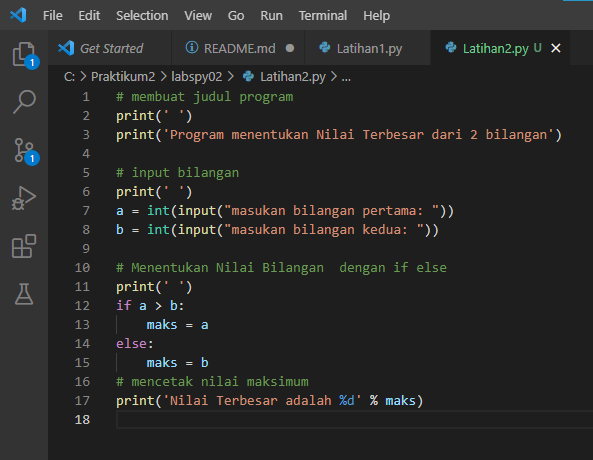

# labspy02

# Lab 2 :  Struktur  Kondisi

# Latihan 1 :

1.	Buat program sederhana dengan input 2 buah bilangan, kemudian tentukan bilangan terbesar dari kedua bilangan tersebut menggunakan statement if.

# Program :

	#membuat judul program

print(' ')

print('Program menentukan Nilai Terbesar dari 2 bilangan')

	#input bilangan

print(' ')

a = int(input("masukan bilangan pertama: "))

b = int(input("masukan bilangan kedua: "))

	#Menentukan Nilai Bilangan  dengan if else

print(' ')

if a > b:

    maks = a

else:

    maks = b

	#mencetak nilai maksimum

print('Nilai Terbesar adalah %d' % maks)

# Hasil output program nilai terbesar :

# Latihan 2 :

1.	Buat program untuk mengurutkan data berdasarkan input sejumlah data (minimal 3 variable input atau lebih), kemudian tampilkan hasilnya secara berurutan mulai dari data terkecil.

def bubble_sort(array):

#jumlah list

    n = len(array)

#perulangan pertama

    for i in range(n):

#perulangan kedua

        for j in range(n - i - 1):

#bandingkan masing-masing elemen

            if array[j] > array[j + 1]:

#jika lebih besar, tukar

                array[j], array[j + 1] = array[j + 1], array[j]

    return array

print(' ')

unordered = [5, 3, 4, 8, 1, 2, 9, 6]

print(bubble_sort(unordered))

# Hasil output program :

# Lab 3: Perulangan

# Latihan 1 :

1.	Buat program dengan perulangan bertingkat (nested) for  yang menghasilkan output sebagai berikut :

# Program :

print(list(range(10)))

print(list(range(1, 11)))

print(list(range(2, 12)))

print(list(range(3, 13)))

print(list(range(4, 14)))

print(list(range(5, 15)))

print(list(range(6, 16)))

print(list(range(7, 17)))

print(list(range(8, 18)))

print(list(range(9, 19)))

# Hasil output program :

# Latihan 2 :

1.	Tampilkan n bilangan acak yang lebih kecil dari 0.5
2.	Nilai n diisi pada saat runtime 
3.	Anda bisa menggunakan kombinasi while dan for untuk menyelesaikannya

# Penjelasan alur program :

1.	print("Tampilkan n bilangan acak yang lebih kecil dari 0.5") - adalah perintah untuk menampilkan judulnya.

2.	jumlah = int(input("Masukkan jumlah n: ")) - adalah perintah untuk menginput nilai n tersebut

3.	import random - adalah perintah untuk mengimport built-in random yang telah tersedia di python

4.	for i in range(jumlah): - adalah perintah untuk i sebagai integer dalam baris jumlah

5.	print("data ke", i+1,"=",(random.uniform(0.1,0.5))) - adalah perintah untuk menampilkan hasil yang telah di input dengan ketentuan random   uniform mulai dari nilai 0.1 sampai 0.5

# program :

# Hasil output perogramnya :

# Tugas Praktikum 2

1.	Buat repository dengan nama labspy02

2.	Buat program sederhana dengan input tiga buah bilangan, dari ketiga bilangan tersebut tampilkan bilangan terbesarnya. Gunakan statement if.

3.	Uraikan langkah atau algoritmanya pada file README.md, sertakan juga flowchart dan screenshot hasil eksekusi program. Tampilkan 3 kondisi inputan data.

4.	Commit dan push pada repository

5.	submit url repository pada classroom

 
# FLOWCHART

Pada flowchart dibawah ini menunjukan percabangan dengan lebih dari satu kondisi.

Flowchart diatas menggambarkan proses untuk menentukan input tiga buah bilangan, dari ketiga bilangan tersebut di tampilkan bilangan terbesarnya. Terdapat 3 buah kondisi yang masing-masing mempunyai ketentuan yang harus dipenuhi untuk menentukan apakah masing – masing bilangan tersebut memenuhi syarat.

# Alur flowchart diatas dapat saya jelaskan seperti berikut :

Apabila suatu bilangan kita inputkan dari yang terkecil sampai yang terbesar maka program tersebut akan menampilkan sebuah bilangan yang terbesar.

# Ini adalah programnya :

# Ini adalah outputnya :

# Tugas Praktikum 3

# Latihan 1: latihan1.py

1.	Tampilkan n bilangan acak yang lebih kecil dari 0.5.
2.	nilai n diisi pada saat runtime
3.	anda bisa menggunakan kombinasi while dan for untuk menyelesaikannya
4.	gunakan fungsi random ( ) yang dapat diimport terlebih dahulu

# program :

